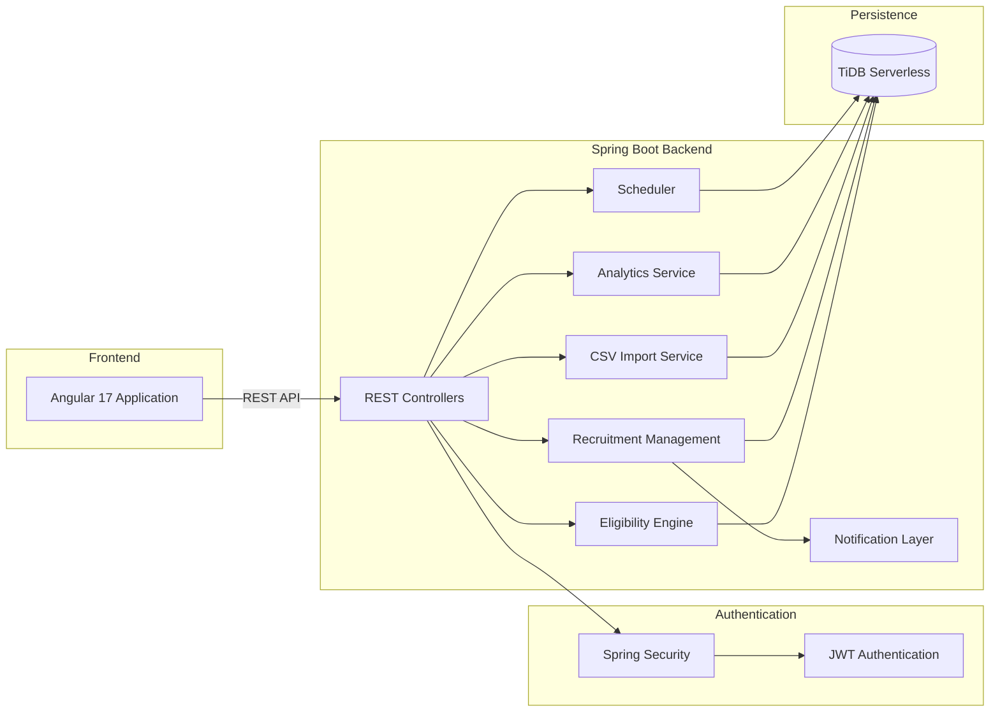
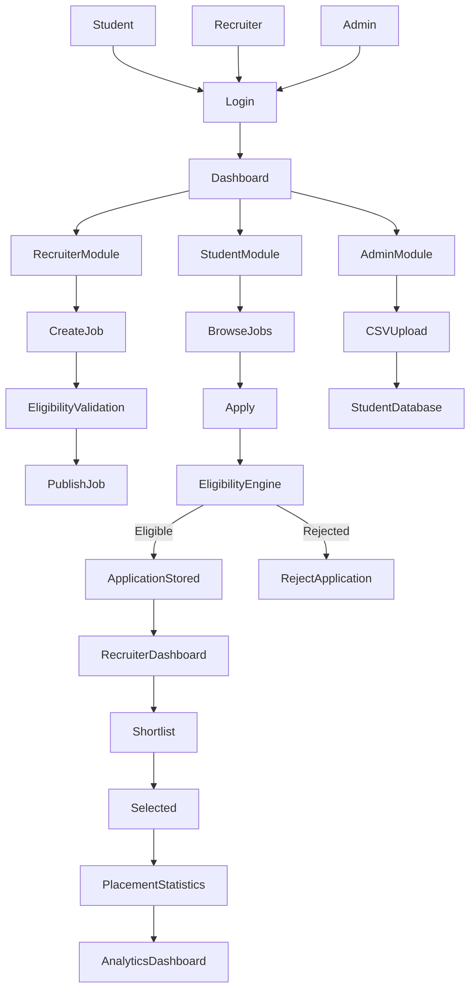

# Campus Recruitment Platform

A full-stack recruitment management platform built to streamline the campus placement process for universities, recruiters, and students.

The platform replaces manual placement workflows with a centralized system for student management, company onboarding, job postings, eligibility verification, application tracking, and recruitment analytics.

---

## Project Overview

Traditional placement drives involve spreadsheets, emails, manual eligibility verification, and repetitive administrative work.

Our goal was to build a platform that automates the complete recruitment lifecycle while ensuring fairness, scalability, and strict eligibility enforcement.

The system supports three different user roles:

- **Administrator**
- **Recruiter**
- **Student**

Each role operates with isolated permissions enforced using JWT-based authentication and Spring Security.

---

# Video Demonstration

<video
src="https://github.com/user-attachments/assets/xxxxxxxx-xxxx-xxxx-xxxx-xxxxxxxxxxxx"
controls
width="100%">
</video>

---

# System Architecture



---

# Recruitment Workflow



---

# Core Features

## Student Portal

- Secure JWT authentication
- Browse available companies
- Automatic eligibility validation
- One-click job applications
- Track application status
- Placement history

---

## Recruiter Portal

- Company profile management
- Create recruitment drives
- Define eligibility criteria
- Review applicants
- Shortlist candidates
- Update recruitment status

---

## Administrator Portal

- Complete platform management
- Student bulk upload through CSV
- Recruiter verification
- Job approval and moderation
- Placement analytics
- User management

---

# Eligibility Engine

One of the core components of the platform is the eligibility engine.

Every application is validated using predefined recruitment constraints before it is stored.

The validation pipeline includes:

- Minimum CGPA
- Academic Branch
- Graduation Year
- Active Backlogs
- Attendance Requirement (optional)
- Already Placed Validation
- Company-specific eligibility rules

Only applications satisfying every condition are persisted to the database.

---

# Technology Stack

## Frontend

| Technology | Purpose |
|------------|----------|
| Angular 17 | Single Page Application |
| TypeScript | Type Safety |
| RxJS | Reactive Programming |
| SCSS | Styling |
| Chart.js | Analytics Dashboard |

---

## Backend

| Technology | Purpose |
|------------|----------|
| Java 21 | Backend Language |
| Spring Boot 3 | REST API |
| Spring Security | Authentication |
| JWT | Authorization |
| Hibernate ORM | ORM |
| Spring Data JPA | Database Access |
| Maven | Dependency Management |

---

## Database

| Technology | Purpose |
|------------|----------|
| TiDB Serverless | Distributed SQL Database |

---

## Deployment

| Component | Platform |
|-----------|----------|
| Backend | Render |
| Frontend | Render Static Site |
| Database | TiDB Cloud |

---

# Security Design

The platform follows stateless authentication.

```text
User Login
      │
      ▼
Authentication Manager
      │
      ▼
JWT Generated
      │
      ▼
Frontend Stores Token
      │
      ▼
Every Request
      │
      ▼
JWT Filter
      │
      ▼
Spring Security
      │
      ▼
Authorized Endpoint
```

---

# Project Structure

```text
Campus-Recruitment-Platform

├── backend
│   ├── controller
│   ├── service
│   ├── repository
│   ├── entity
│   ├── dto
│   ├── config
│   ├── security
│   └── util
│
├── frontend
│   ├── src
│   │   ├── app
│   │   ├── pages
│   │   ├── shared
│   │   ├── services
│   │   └── guards
│
└── README.md
```

---

# Local Development

## Prerequisites

- Java 21
- Maven
- Node.js 18+
- Angular CLI
- Git

---

## Backend

```bash
cd backend

./mvnw spring-boot:run
```

Environment Variables

```text
DB_URL

DB_USERNAME

DB_PASSWORD

JWT_SECRET

JWT_EXPIRATION_MS

APP_CORS_ALLOWED_ORIGINS
```

Backend runs on

```
localhost:8080
```

---

## Frontend

```bash
cd frontend

npm install

npm start
```

Frontend runs on

```
localhost:4200
```

---

# Future Enhancements

- Resume parsing using AI
- Email notifications
- Interview scheduling
- Company analytics dashboard
- Student recommendation engine
- Resume ranking
- Placement prediction
- OCR-based transcript verification

---

# Team

Built during the hackathon by our team with a focus on scalable backend architecture, secure authentication, and an intuitive user experience.

---

# License

This project is intended for educational and hackathon purposes.
