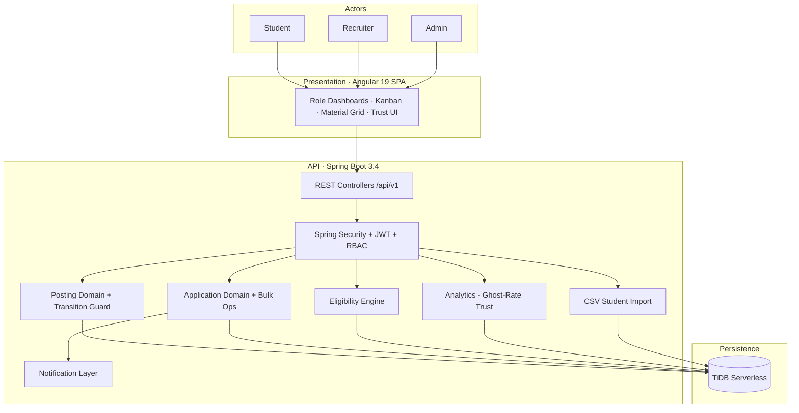
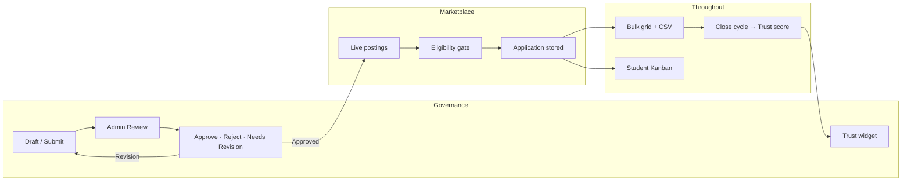
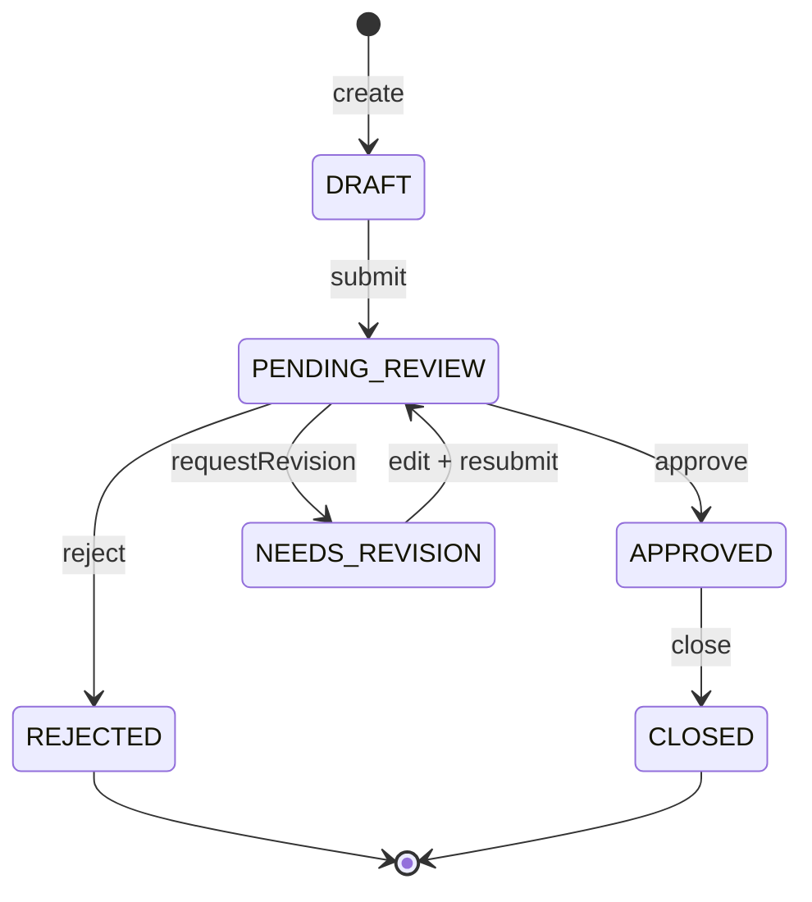
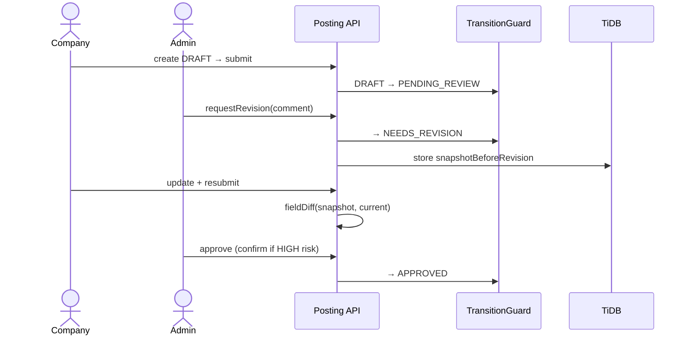
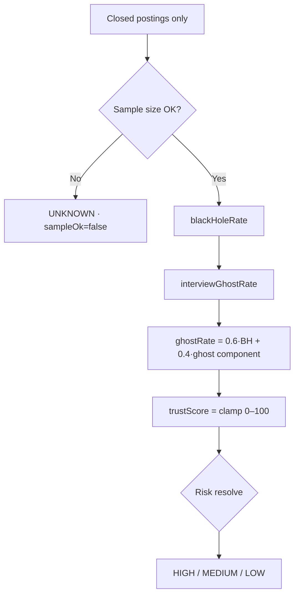

# Campus Recruitment Platform (CRP)

> Enterprise-grade campus placement infrastructure for Training & Placement Offices - designed for **workflow correctness**, **recruiter throughput**, and **measurable hiring integrity**.

[](#technology-stack)
[](#technology-stack)
[](#technology-stack)
[](#technology-stack)
[](#core-engineering-philosophy)

A full-stack recruitment platform that replaces spreadsheet-driven placement ops with a centralized system for student provisioning, company onboarding, job governance, eligibility enforcement, application tracking, and integrity analytics.

---

## Video Demonstration

[](https://drive.google.com/file/d/11ZyYHDAjAY2X0BKbu6xyXcG8BTUfCLqU/view)


---

## Demo Credentials

| Role | Email | Password |
|---|---|---|
| Admin | `admin-sejal@crp.com` | `B5jW3qL8zT` |
| Company | `micorsoft@career.outlook.in` | `microsoft` |
| Student | `lonavlakhandala@abc.com` | `hE3HHExIFc` |

---

## Why this exists

University placement systems usually fail in three places:

| Real failure | Typical campus portal | CRP |
|---|---|---|
| Admins can only Approve / Reject | Binary gate | **Revision workflow** with comments, snapshots, and field diffs |
| Recruiters drown in 200+ applicants | One-by-one clicks | **Bulk status grid + CSV export** |
| Students live in an application black hole | Flat status lists | **Kanban pipeline visibility** |
| Ghosting companies go unnoticed | Vanity charts | **Closed-cycle Ghost-Rate Trust Score** |

---


## Signature Features

### 1. Revision Request Workflow (governed hiring intake)
Job postings are not free-form CRUD. They move through a **guarded state machine**:

`DRAFT → PENDING_REVIEW → APPROVED | REJECTED | NEEDS_REVISION → CLOSED`

- Illegal transitions return `409 Conflict`
- Revision requires an admin comment
- Pre-revision **JSON snapshot** enables field-level diffs on resubmit
- Admins see *what changed* before re-approving

### 2. Batch Actions + CSV Hub + Student Kanban
- **Company:** Material data-grid with multi-select, bulk Shortlist / Reject, and one-click CSV export (Name, Email, CGPA, Branch, Status, Resume)
- **Student:** Kanban board - Applied → Under review → Shortlisted → Offered / Rejected

### 3. Ghost-Rate Trust Score (hiring integrity metric)
Trust is computed from **closed postings only** (open cycles are excluded):

- Black-hole rate (untouched applications)
- Interview ghost rate
- Composite ghost rate + sample-size gate (`UNKNOWN` when history is thin)
- Risk levels: `HIGH` / `MEDIUM` / `LOW` / `UNKNOWN`
- HIGH-risk companies trigger an **approve confirmation** in the admin queue
- Analytics leaderboard surfaces highest-risk recruiters

### 4. Strict Eligibility Engine
Every application is validated before persistence:

- Minimum CGPA · Academic branch · Graduation year · Active backlogs
- Already-placed / anti-hoarding lock once `SELECTED`
- Company-specific constraints

A single failure blocks database insertion.

---

## High-Level Design (HLD)



### Capability map



---

## Low-Level Design (LLD)

### Posting state machine



### Revision sequence



### Trust score computation



---

## Role Portals

### Student
- JWT login (provisioned by admin CSV - no self-registration)
- Browse live postings + one-click apply
- Automatic eligibility validation
- Kanban application tracking

### Recruiter
- Quarantined onboarding until admin approval
- Draft → submit posting workflow
- Applicant Material grid with bulk Shortlist / Reject
- CSV export of eligible applicants

### Administrator
- Student bulk CSV upload
- Company verification
- Job approval / rejection / **needs revision**
- Trust widget + analytics leaderboard

---

## Core Engineering Philosophy

- **Strict mathematical eligibility** - CGPA, branch, graduation year, backlogs. Any failure blocks insert.
- **Anti-hoarding protocol** - once `SELECTED`, the student is locked from further applications.
- **Closed-loop student auth** - students are not self-registered; admins provision via CSV from academic records.
- **Recruiter quarantine** - company accounts require admin approval before posting rights.
- **Guarded workflows** - posting transitions are centralized; illegal moves never silently corrupt state.
- **Audit-capable revisions** - snapshots + diffs make administrative decisions explainable.
- **Sample-aware analytics** - thin history never becomes a false HIGH-risk accusation.
- **Ops throughput** - bulk mutations share one `applyStatusChange` path (single source of truth).

---

## Technology Stack

| Layer | Choice |
|---|---|
| Backend | Java 21 · Spring Boot 3.4 · Spring Security 6 (stateless JWT) · Spring Data JPA |
| Frontend | Angular 19 (standalone) · Angular Material · RxJS · Chart.js / ng2-charts · SCSS |
| Database | TiDB Serverless (MySQL-compatible distributed SQL) |
| Delivery | Render (API + static frontend) · Angular proxy for local `/api` |

---

## Project Structure

```text
hackthon26/
├── backend/                 # Spring Boot API
│   └── src/main/java/com/credx/campus/
│       ├── config/          # Security, seeder, status migration
│       └── domain/          # auth · posting · application · analytics
├── frontend/                # Angular SPA
│   └── src/app/
│       ├── pages/           # role dashboards + feature UIs
│       ├── core/            # ApiService, CSV export
│       └── components/      # chips, shell, headers
└── scripts/                 # smoke-revision · smoke-batch-kanban · smoke-trust-score
```

---

## Local Development Setup

### Prerequisites
- JDK 21
- Node.js 18+
- Maven Wrapper (`mvnw` included)

### Backend
```bash
cd backend
# Required env:
# DB_URL, DB_USERNAME, DB_PASSWORD, JWT_SECRET
# Optional: JWT_EXPIRATION_MS, APP_CORS_ALLOWED_ORIGINS=*
./mvnw spring-boot:run
```
API: `http://localhost:8080`

### Frontend
```bash
cd frontend
npm install
npm start
```
App: `http://localhost:4200` (proxies `/api` → `:8080`)

### Smoke verification
```powershell
.\scripts\smoke-revision-workflow.ps1
.\scripts\smoke-batch-kanban.ps1
.\scripts\smoke-trust-score.ps1
```

---


